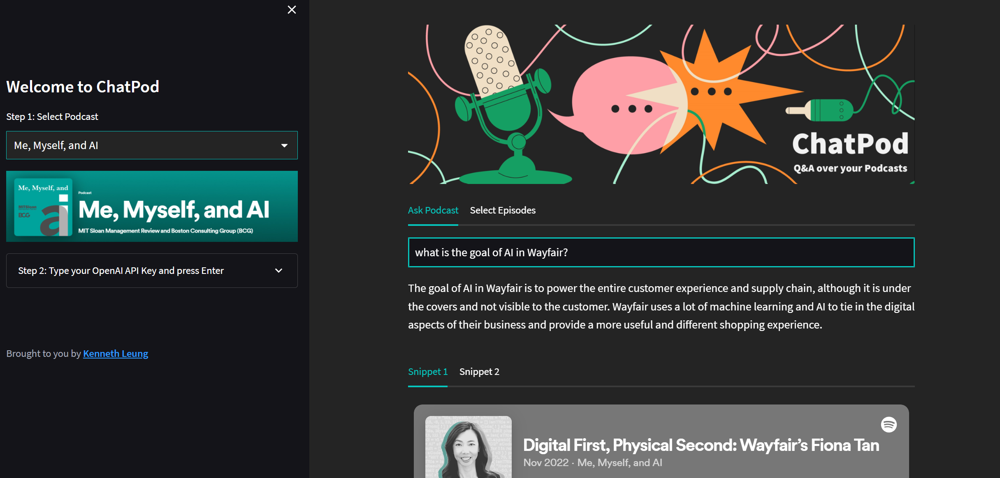

# ChatPod - Q&A over your Podcasts

**Visit ChatPod at https://chatpod.onrender.com** (Currently inactive, ping me if you would like to view the demo)

## Context
- With the increasing popularity of podcasts, we recognized the need for a more efficient way to search through and extract relevant information from these audio files.
- This project (ChatPod) leverages the power of ChatGPT to accurately process natural language queries and retrieve relevant portions of the podcast transcripts. 

___

## Tools
- Feedparser: RSS feed processing
- Whisper: Voice-to-text
- FAISS: Vectorstore
- LangChain: Overall backend framework
- OpenAI ChatGPT: Large language model (`gpt-turbo-3.5`)
- Streamlit: Frontend interface
- Render: Deployment of Dockerized app (cron-job.org to keep instance active)
___

## To Do
- [ ] Create Upload page (pipeline from audio to chat over vectorstore)
